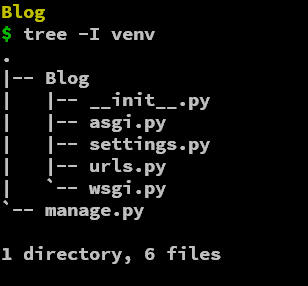

# What ?

Django is a **MVT** framework used to build backend of various websites 

## MVT 
> M - Model ( data representation and manipulation layer )
> V -  View ( works more like a **Controller** that defines what function to run once a route is visited )
> T - Template ( the actual view layer with files in HTML format )

#### Models

Models represent data in our database in the form of python Objects. 
 
```python

from django.db import models
from django.contrib.auth.models import User

# Create your models here.
class Task(models.Model):
    user = models.ForeignKey(User, on_delete=models.CASCADE,null=True, blank=True)
    title = models.CharField(max_length=200)
    completed = models.BooleanField(default=False)
    created_at = models.DateTimeField(auto_now_add=True)

    def __str__(self):
        return self.title

    # meta data to show what to order the items by 
    class Meta:
        ordering =['completed']
		
```

The above code creates a Task table with user, title ,completed, created_at fields 

```js
Task {
	user: number,
	title: string,
	completed: boolean,
	created_at: DateTime
}
```

### Views
Views are the function you define that runs when a particular route is viewed. 

```python 
# Example route -> /blog

# file urls.py
urlpatterns= [path("/blog"), view = views.handleBlog]
# ------------------------------------------------------

# file views.py 
"""
this function is triggered when /blog page is accessed
"""
def handleBlog(request): 
	return HttpResponse("Blog page")

```

`Note:  In Django, Views != HTML ` 


### Templates

Templates are the static files like HTML that is to be rendered when a route is accessed. Django provides further functionality by embedding logic in templates through [JInja](https://jinja.palletsprojects.com/en/3.1.x/templates/).
```django
<!DOCTYPE html>
<html lang="en">
<head>
    <title>My Webpage</title>
</head>
<body>
    <ul id="navigation">
    
        <li><a href="{{ item.href }}">{{ item.caption }}</a></li>
    
    </ul>

    <h1>My Webpage</h1>
    {{ a_variable }}

    {# a comment #}
</body>
</html>


```

### Default folder structure 
*Folder structure for a project named Blog*



 *  __init\__.py  -> indicates the folder is a module
 * asgi.py & wsgi.py -> communicates with the web server 
 * settings.py -> place to configure project settings (stuff like: DB conf, SMTP conf and more)
 * urls.py -> place to define url routes 
 


